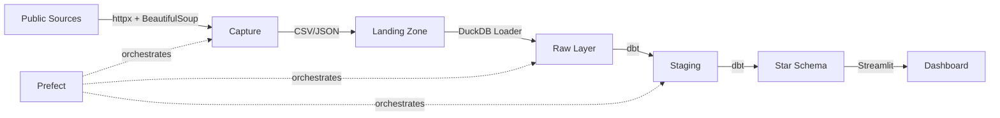

# 🏛️ Mexican Legislative Data Pipeline

End-to-end data pipeline that captures, structures, and analyzes Mexican
legislative data — data that did not exist in structured form before this
project.

## Why this project

Mexican legislative data (roll-call votes, attendance, committee composition)
lives scattered across government websites with no structured APIs. This
pipeline captures it, models it into a dimensional schema, and exposes it for
analysis.

**The differentiator:** this is not a project consuming a Kaggle CSV. It is
infrastructure for data that required custom capture instrumentation.

## Architecture



## Stack

| Layer | Technology |
|---|---|
| Capture | Python, httpx, BeautifulSoup |
| Warehouse | DuckDB (local) / Snowflake (production) |
| Transformation | dbt with dbt-duckdb |
| Orchestration | Prefect 3.x |
| Dashboard | Streamlit + Plotly |
| CI/CD | GitHub Actions, Ruff, Mypy, Pytest |

## Project structure

```
legislative-data-pipeline/
├── src/
│   ├── capture/          # Scrapers and API clients
│   │   ├── base.py       # Base scraper with retries and logging
│   │   ├── dipmex.py     # Client for dipMex (academic data, legs 60-61)
│   │   └── sitl.py       # SITL scraper: per-deputy roll-calls + tallies (leg 66 captured; 64/65 supported, capture pending — see research/)
│   ├── loaders/          # Loaders to DuckDB/Snowflake
│   ├── models/           # Pydantic models (data contracts)
│   └── config.py         # Centralized configuration
├── scripts/              # ingest_dipmex, ingest_sitl, backfill_sitl_meta
├── sql/ddl/              # DDL for Snowflake (3 layers)
│   ├── 01_raw_schema.sql
│   ├── 02_staging_schema.sql
│   └── 03_dimensional_models.sql
├── dbt_project/          # dbt transformations
│   ├── models/staging/   # Cleaning and deduplication
│   └── models/marts/     # Dimensional star schema
├── dashboard/            # Streamlit app
│   └── app.py
├── tests/                # Pytest suite
├── docs/                 # ADRs and architecture
│   ├── architecture.md
│   └── adr/
└── .github/workflows/    # CI pipeline
```

## Quick Start

```bash
# Clone and install
git clone <repo-url>
cd legislative-data-pipeline
pip install -e ".[dev,dashboard,dbt]"

# Run the real pipeline (no orchestrator needed — three plain steps)
python scripts/ingest_dipmex.py           # download + land real dipMex (legs 60-61)
python scripts/ingest_sitl.py             # land the SITL capture from local CSVs (no network)
cd dbt_project && dbt build               # staging + star schema + tests

# Launch dashboard
streamlit run dashboard/app.py

# Run tests
pytest tests/ -v
```

## Dimensional model

A **conformed star schema** spanning legislatures **60, 61 (dipMex) and 66 (SITL)**,
whose `dim_legislator` keeps a **dated version history** (a functional SCD Type 2).
Votes are attributed **as-of** the vote date (the version whose validity span
contains it), never via `is_current`.

- **dim_legislator** — one dated version per validity span, conformed across both
  real sources with stable key `md5(source | legislator_id | legislature | effective_from)`:
  - *dipMex (60-61)* — versioned by **legislature term**: the roster's in/out dates
    proved too imprecise to *bound* the roll-call, so the term is the reliable
    boundary and occupancy stays as descriptive attributes (ADR 003).
  - *SITL (66)* — versioned by **dated party run**: a new version each time a
    deputy's caucus label changes between votes, so caucus switches are real and
    dated (ADR 004).
- **fact_vote** — one row per legislator per vote (**798k real attributed votes**
  across the three legislatures), as-of joined to `dim_legislator` on
  `(source, legislator_id)`. dipMex votes are id-native (the roll-call matrix is
  keyed by the stable id); SITL votes carry the deputy's name and party on every
  vote, which is what drives the dated caucus history.
- **fact_vote_summary** / **dim_party** — vote-event tallies and party reference.
- **Analytical views** — `v_party_cohesion` (Rice index, discipline *within* a
  party), `v_party_agreement` (share of votes two parties take the same side on —
  alignment *between* parties), `v_legislator_attendance`, `v_legislator_party_switches`
  (caucus-switch classification).

Build it for real — dipMex from GitHub, SITL from the local capture:

```bash
python scripts/ingest_dipmex.py          # download + land real dipMex (legs 60-61)
python scripts/ingest_sitl.py            # land the SITL capture (legs 64-66, no network)
cd dbt_project && dbt build              # 798,445 attributed votes, all tests green
```

Real findings fall straight out:

- **Party cohesion (Rice index), LXVI** — every caucus is near-unanimous: PAN 1.00,
  PVEM 0.999, PRI 0.998, MORENA 0.997, MC 0.995, PT 0.993. A highly disciplined chamber —
  and distinctly more so than the past: in legislatures 60-61 opposition caucuses ran
  to 0.87-0.93, so LXVI's *least* cohesive party is tighter than the *most* cohesive
  party fifteen years earlier.
- **Inter-party alignment, LXVI** — the six caucuses resolve into two blocs:
  government MORENA / PVEM / PT agree 98.9-100% of the time, opposition PRI / PAN / MC
  agree 88-94%, and the two blocs share a side on only 58-70% of votes. The PRI votes
  with the PAN 94% of the time and with MORENA 58%.
- **Caucus switches, LXVI** — of 82 deputies with ≥2 dated versions, only **15 are
  clean monotonic switches**; 67 are intra-coalition label oscillation (MORENA / PVEM /
  PT are the governing coalition), not real defections. A dbt test confirms our
  per-deputy capture reproduces SITL's **official tallies on all 274 votes**.
- *(Earlier, dipMex LXI cohesion: PVEM 98.8%, PRI 98.5%, PAN 98.1%, … PT 89.3%.)*

See [ADR 003](docs/adr/003-legislator-dated-history-and-identity-bridge.md) and
[ADR 004](docs/adr/004-conform-sitl-recent-legislatures.md).

## Design decisions

Technical decisions are documented as ADRs in [`docs/adr/`](docs/adr/):

- [ADR 001: Prefect over Airflow](docs/adr/001-orchestrator-choice.md)
- [ADR 002: Star schema over Snowflake schema](docs/adr/002-star-schema-design.md)
- [ADR 003: Dated legislator history (functional SCD2) + identity bridge + as-of join](docs/adr/003-legislator-dated-history-and-identity-bridge.md)
- [ADR 004: Conform the SITL recent legislatures into one star (dated party-run history)](docs/adr/004-conform-sitl-recent-legislatures.md)

## Data sources

| Source | Type | Data |
|---|---|---|
| [dipMex](https://github.com/emagar/dipMex) | CSV (GitHub) | Complete roll-call matrix + rosters, legislatures 60-61 |
| [SITL](https://sitl.diputados.gob.mx) (Chamber of Deputies) | HTML (scraping) | Per-deputy roll-call votes + official tallies, legislature 66 captured; 64/65 supported by the scraper but not yet captured (needs a run from a network that resolves the government host — see [research/captura_pendiente_64_65.md](research/captura_pendiente_64_65.md)) |

## CI/CD

GitHub Actions runs on every push/PR:
- **Ruff** — Linting and formatting
- **Mypy** — Type checking
- **Pytest** — Unit tests with coverage
- **dbt compile** — SQL model validation

---

*Portfolio project by Mario Casanova — Senior Business Analyst.*
*Demonstrates: production Python, DuckDB, dbt, advanced SQL, ETL/orchestration, dimensional modeling, BI.*
