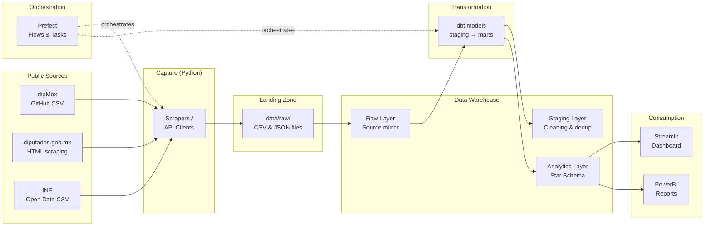

# Legislative Data Pipeline — Architecture

## Overall diagram

## Pipeline layers

### 1. Capture (`src/capture/`)
- **DipMexClient:** Downloads the academic roll-call dataset from GitHub (complete coverage for legislatures 60-61).
- **SitlScraper:** Captures per-deputy roll-call votes, per-vote metadata (date/title), and official per-party tallies from `sitl.diputados.gob.mx` (legislatures 64-66). Incremental + idempotent; follows the per-vote `estadistico` summary to enumerate party-group pages.
- **BaseScraper:** Base class with retry logic (exponential backoff), rate limiting, and structured logging.

### 2. Landing Zone (`data/raw/`)
- CSV/JSON files exactly as captured.
- Each file carries lineage metadata (`_source_file`, timestamp).
- Immutable: never modified after capture.

### 3. Raw Layer (DuckDB: `raw` schema)
- Faithful mirror of captured files.
- Metadata columns: `_source_file`, `_loaded_at`.
- No business transformations.

### 4. Staging Layer (dbt: `staging/`)
- Cleaning: type casting, string normalization.
- Deduplication: `ROW_NUMBER()` over business keys.
- Standardization: Spanish vote values → English enum (`FAVOR` → `FOR`).
- Deterministic surrogate keys (MD5 hash).

### 5. Analytics Layer (dbt: `marts/`)
- **Conformed star schema** spanning legislatures 60/61 (dipMex) and 66 (SITL),
  with a **dated version history** (SCD Type 2) on `dim_legislator` — term-grain
  for dipMex, dated party-run grain for SITL (see ADR 003 / ADR 004).
- Dimensions: `dim_legislator`, `dim_party`.
- Facts: `fact_vote` (per-legislator, as-of joined), `fact_vote_summary` (aggregate).
- Analytical views: `v_party_cohesion` (Rice index), `v_legislator_attendance`,
  `v_legislator_party_switches` (caucus-switch classification).

### 6. Consumption (`dashboard/`)
- Streamlit app with three views: Overview, Party Analysis, Legislator Profiles.
- Connects directly to DuckDB (local) or Snowflake (production).
- Visualizations with Plotly for interactivity.

## Technology stack

| Component | Technology | Rationale |
|---|---|---|
| Language | Python 3.11+ | Main stack; type hints, async support |
| HTTP client | httpx | Async-ready, connection pooling |
| Scraping | BeautifulSoup + lxml | Robust for legislative HTML |
| Warehouse (local) | DuckDB | Columnar, SQL-compatible, zero-config |
| Warehouse (prod) | Snowflake | Enterprise DWH with streams, tasks, time travel |
| Transformation | dbt (dbt-duckdb) | SQL-based transforms, testing, documentation |
| Orchestration | Prefect 3.x | Pythonic, zero-infra local, native retries |
| Validation | Pydantic 2.x | Data contracts between layers |
| Dashboard | Streamlit + Plotly | Quick to build, interactive, exportable |
| CI/CD | GitHub Actions | Lint, type check, tests, dbt compile |
| Linting | Ruff | Fast; replaces flake8 + isort + black |
| Type check | Mypy | Static type verification |
| Testing | Pytest | Standard, fixtures, parametrize, coverage |
