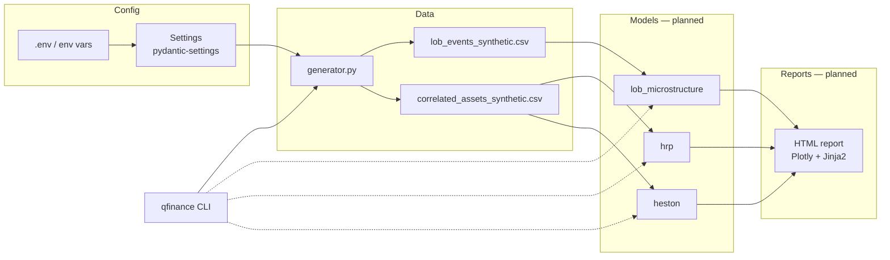

# quantitative-finance

> Production-grade toolkit for three foundational quantitative-finance workloads:
> Limit Order Book microstructure, exotic-option pricing under stochastic
> volatility, and Hierarchical Risk Parity portfolio allocation.

[](https://github.com/MarioCasanovacf/Portfolio/actions)
[](https://www.python.org/downloads/)
[](LICENSE)
[](https://github.com/astral-sh/ruff)

## Why this project

The three workloads here — LOB reconstruction, Asian-option valuation under the
Heston model, and HRP capital allocation — are canonical exercises of
quantitative finance that usually live in scattered notebooks with no surrounding
infrastructure. This repo promotes them to an installable, bit-reproducible,
fully tested toolkit.

The point isn't to publish new findings; it's to **demonstrate engineering
maturity** in a domain most portfolios only prototype.

## Stack

| Layer | Technology | Why |
|---|---|---|
| Configuration | `pydantic-settings` v2 | Type-safe, env-aware, hierarchical |
| Logging | `structlog` v24 | Structured, contextual output |
| Data | `numpy` + `pandas` | Standard of the quant stack |
| Models | `scipy`, `scikit-learn` | Hierarchical clustering for HRP, optimization |
| Tests | `pytest` + `pytest-cov` | `unit`/`integration` markers, 75% threshold |
| Quality | `ruff` + `mypy` (strict) + `bandit` + `gitleaks` | Pre-commit + CI |
| CI | GitHub Actions | Matrix Python 3.11/3.12/3.13 |

## Architecture



## Quick Start

```bash
git clone https://github.com/MarioCasanovacf/Portfolio.git
cd Portfolio/quantitative_finance
pip install -e ".[dev,notebooks]"
qfinance generate-data --all     # regenerate both deterministic CSVs
pytest -m unit                   # fast tests
jupyter lab notebooks/           # open the analyses
```

## Layout

```
quantitative_finance/
├── src/quantitative_finance/
│   ├── config.py            # Pydantic Settings, env_prefix QFINANCE_
│   ├── cli.py               # qfinance entrypoint
│   ├── data/
│   │   └── generator.py     # LOB + asset prices, deterministic
│   ├── utils/
│   │   └── logging.py       # structlog setup
│   └── models/              # [planned] HRP, Heston, LOB analytics
├── tests/
│   ├── conftest.py          # shared fixtures
│   └── unit/                # tests with @pytest.mark.unit | integration
├── notebooks/               # exploratory analyses
├── data/                    # generated CSVs
├── docs/
│   ├── architecture.md
│   └── adr/                 # Architecture Decision Records
├── .github/workflows/ci.yml
├── .pre-commit-config.yaml
└── pyproject.toml
```

## Configuration

Every option can be overridden via environment variables prefixed with
`QFINANCE_`, or through a `.env` file:

```bash
QFINANCE_RANDOM_SEED=99 qfinance generate-data --lob
QFINANCE_LOB_N_EVENTS=100000 qfinance generate-data --lob
QFINANCE_LOG_LEVEL=DEBUG qfinance generate-data --all
```

See [`config.py`](src/quantitative_finance/config.py) for the full list.

## ADRs

Architecture decisions recorded in [`docs/adr/`](docs/adr/):

- [001 — Synthetic data strategy](docs/adr/001-synthetic-data-strategy.md)
- [002 — Modular package layout vs flat](docs/adr/002-modular-vs-flat-layout.md)

## Contributing

See [CONTRIBUTING.md](CONTRIBUTING.md).

## Roadmap

See [CHANGELOG.md](CHANGELOG.md) for what's shipped and what's planned next
(notebook-to-module promotion, HTML reports, walk-forward validation).

## License

MIT — see [LICENSE](LICENSE).
