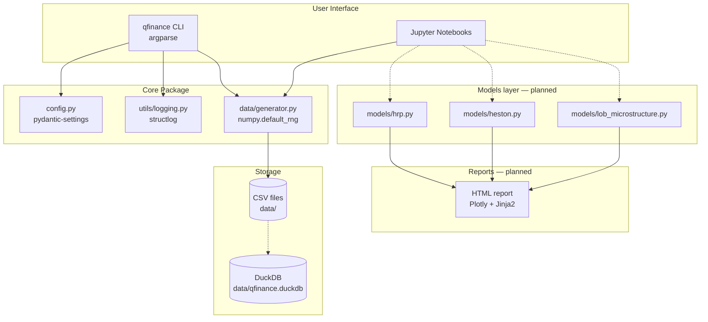
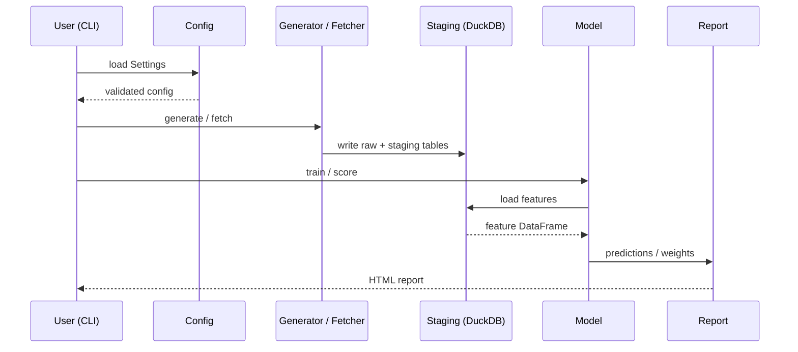

# Architecture

## High-level

## Data flow (current state)

1. **Generation** — `qfinance generate-data` invokes `data.generator.generate_all` which:
   - Reads `Settings` (env vars + defaults).
   - Builds two seeded `numpy.random.Generator` instances (offset by 1 to decouple LOB and asset streams).
   - Produces `lob_events_synthetic.csv` and `correlated_assets_synthetic.csv`.
2. **Analysis** — Notebooks load the CSVs, run their respective algorithms, and visualize results inline.

## Data flow (target state)

## Module responsibilities

| Module | Responsibility | Stable API? |
|---|---|---|
| `config` | Single source of truth for tunables. | ✅ |
| `utils.logging` | Process-wide structlog setup. | ✅ |
| `data.generator` | Reproducible synthetic data, pure-function core + I/O wrapper. | ✅ |
| `cli` | Thin orchestration over data & models. | ✅ |
| `models.*` | Algorithmic implementations (HRP, Heston, LOB). | ⏳ planned |
| `reports.*` | HTML + chart rendering. | ⏳ planned |

## Determinism invariant

The generator MUST produce bit-identical output for a given `(random_seed,
lob_n_events, assets_n, assets_n_days, regime windows)` tuple. This is enforced
by `test_lob_deterministic`, `test_assets_deterministic`, and `test_idempotent_runs`.
Any future change touching `data/generator.py` must re-run the test suite and
update fixtures intentionally if the contract is broken.
