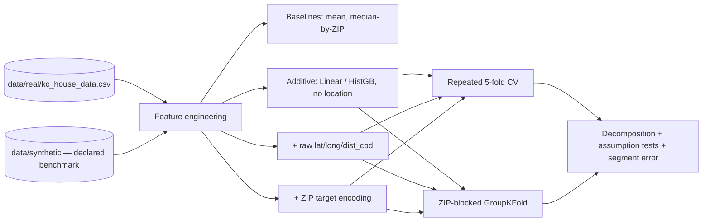

# real-estate

> How much does location actually buy you on the **real King County, WA housing market**
> (21,613 sales, 2014–2015) — and does that lift survive contact with a ZIP code the model
> has never seen a sale in, or is it mostly memorization of neighborhood averages?

[](https://www.python.org/downloads/)
[](LICENSE)

## Why this project

This project used to run entirely on data I fabricated myself, with a spatial price surface
planted directly into the generator (three Gaussian "hotspots" over `lat`/`long`) — which meant
the "gradient boosting wins" conclusion in the old version was never a finding, only proof that
the pipeline could recover a signal I put there on purpose. That is a tautology, not an
analysis, and the notebook itself already said so in its last cell before this revival.

The fix is not a better model. It's real data. `data/real/kc_house_data.csv` is the canonical
King County dataset (public county sale records, CC0), and the question the notebook now asks —
how much of the observed "location matters" lift is a genuine, generalizable geographic surface
versus a memorized ZIP-code average — has an answer nobody, including me, knew in advance. The
fabricated file survives, demoted to exactly one job: a declared positive-control benchmark with
every generating parameter stated next to any number it's compared against.

## The question

> On the real King County market, how much predictive lift does modeling location as a
> non-additive surface buy over a strong additive baseline — and does that lift survive
> ZIP-code-blocked cross-validation, or does it collapse once the model can no longer average
> over sales it has already seen in that exact neighborhood?

Read the notebook's §5 for the answer; the short version is that raw coordinates carry a real,
moderate, and largely durable geographic signal, while ZIP-code target encoding carries a much
larger *apparent* lift under ordinary cross-validation that mostly evaporates once ZIP codes are
held out entirely — and the real market's location structure turned out to be considerably
stronger than the one I planted in the synthetic benchmark file, which is not the direction I
expected going in.

## Data

| File | Rows | Role |
|---|---|---|
| `data/real/kc_house_data.csv` | 21,613 sales, 2014-05 to 2015-05 | The market. Source of every claim about King County. |
| `data/synthetic/kc_house_data_synthetic.csv` | 5,000 fabricated rows, seed 42 | A declared benchmark — proves the pipeline recovers a *known* planted signal, never evidence about the real market. |

Full provenance (mirror URLs, sha256, license, known gotchas) and every synthetic generator
parameter: `data/README.md`.

## Method, in one paragraph

Every data-dependent transform (imputation, scaling, ZIP-code target encoding) is fit inside the
cross-validation fold, never before the split. Uncertainty is reported as mean ± sd over a
repeated 5-fold CV (15 fits), not a single train/test split. A second CV scheme, `GroupKFold` on
`zipcode`, holds entire neighborhoods out of training to separate genuine spatial generalization
from memorized ZIP-code averages. The exact `sqft_above + sqft_basement = sqft_living` identity
is resolved (VIF-checked) rather than left in the feature set. Model comparison hyperparameters
are tuned once, declared in the notebook, and reused across variants so the location-lift
comparison stays apples-to-apples. Three assumption tests are executed (not just described) on
out-of-fold residuals: normality, heteroscedasticity (Breusch-Pagan), and spatial autocorrelation
(Moran's I, implemented from scratch in `src/spatial_diagnostics.py` since `esda`/`libpysal`
aren't in the shared venv — validated in the test suite against a case with a known answer).

## Analysis

| Notebook | Question |
|---|---|
| `notebooks/house_sales_king_county.ipynb` | How much predictive lift does location buy, and does it generalize? |

## Architecture



## Quick start

```bash
git clone https://github.com/MarioCasanovacf/Portfolio.git
cd Portfolio/01_professional/real_estate
pip install -e ".[dev,notebooks]"
python -m pytest -m unit
jupyter lab notebooks/house_sales_king_county.ipynb
```

`pytest` ships in the shared portfolio venv (`Portfolio-repo/.venv`); if you're running this
project standalone outside that venv, install the `dev` extra above first.

## License

MIT — see [LICENSE](LICENSE).
