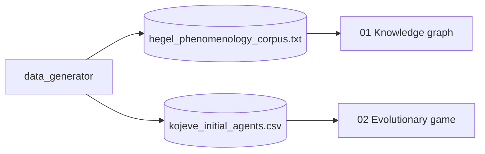

# continental-philosophy

> Continental philosophy approached with quantitative methods: a
> **dialectical knowledge graph** over Hegel's *Phenomenology of Spirit* corpus,
> and an **evolutionary game theory** simulation over Kojève's master/slave
> dialectic.

[](https://www.python.org/downloads/)
[](LICENSE)

## Why this project

Continental philosophy is rarely modeled computationally. This project
demonstrates that two of its central apparatuses — **dialectics** (Hegel) and
the **struggle for recognition** (Kojève) — can be represented as (a) a
directed graph with eigenvector centrality, and (b) an evolutionary system of
agents with asymmetric payoffs. The point isn't exegesis; it's to show that
quantitative tools can illuminate arguments that usually live only in prose.

## Stack

| Layer | Technology |
|---|---|
| Corpus + graph | `networkx` + light tokenization |
| Centrality | `networkx.eigenvector_centrality` |
| Recognition dynamics | `numpy` + `networkx` (agent-based percolation) |
| Visualization | `matplotlib` |

## Notebooks

| # | Notebook | Method |
|---|---|---|
| 01 | `01_Dialectical_Knowledge_Graph.ipynb` | Dialectical graph + centrality |
| 02 | `02_Kojeve_Evolutionary_Game_Theory.ipynb` | Master/slave dialectic as a recognition-network that percolates to the Universal State |

## Architecture



## Quick Start

```bash
git clone https://github.com/MarioCasanovacf/Portfolio.git
cd Portfolio/continental_philosophy
pip install -e ".[dev,notebooks]"
python src/data_generator.py
jupyter lab notebooks/
pytest -m unit
```

## License

MIT — see [LICENSE](LICENSE).
