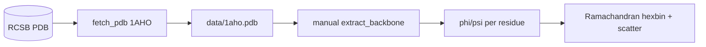

# proteins-ramachandran-plot

> Ramachandran plots (φ/ψ dihedral angles) generated from real PDB structures —
> case study: **1AHO** (a small neurotoxin with well-defined α-helices and β-sheets).

[](https://www.python.org/downloads/)
[](LICENSE)

## Why this project

The Ramachandran plot is the canonical tool for validating protein folding —
each point corresponds to a (φ, ψ) pair per residue, and the allowed regions
reflect universal steric constraints. Reproducing it from scratch (without
PyMOL or Chimera) demonstrates practical command of molecular geometry and of
PDB coordinate formats — implemented directly, with no specialist library.

## Stack

| Layer | Technology |
|---|---|
| Fetch | `urllib` + RCSB PDB |
| Parsing | `stdlib` (manual PDB line parser) |
| Dihedral computation | `numpy` (cross products, atan2) |
| Visualization | `matplotlib` (hexbin log-density + scatter) |

## Architecture



## Quick Start

```bash
git clone https://github.com/MarioCasanovacf/Portfolio.git
cd Portfolio/proteins_ramachandran_plot
pip install -e ".[dev,notebooks]"
python src/data_fetcher.py
jupyter lab notebooks/
pytest -m unit
```

## Layout

```
proteins_ramachandran_plot/
├── src/data_fetcher.py
├── notebooks/01_Ramachandran_Plot_Generator.ipynb
├── data/1aho.pdb
├── tests/unit/test_data_fetcher.py
└── pyproject.toml
```

## License

MIT — see [LICENSE](LICENSE).
