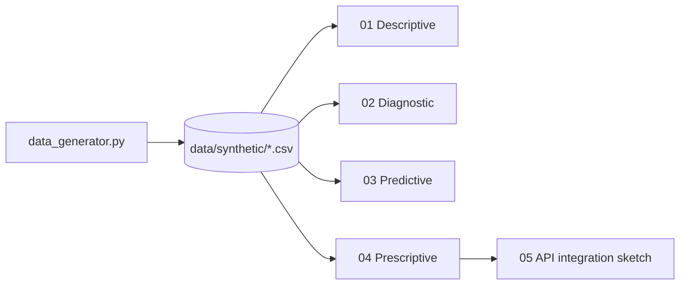

# cloud-infrastructure-support

> End-to-end analytical pipeline on synthetic cloud infrastructure telemetry —
> the four pillars of analytics (descriptive, diagnostic, predictive,
> prescriptive) applied to logs, tickets, and server health metrics.

[](https://www.python.org/downloads/)
[](LICENSE)

## Why this project

Cloud "support" organizations (SRE / NOC / DevOps) accumulate tons of
heterogeneous telemetry: structured logs, CPU/memory metrics, incident
tickets. The interesting question isn't "what happened?" but "what's about
to happen, and what should we do about it?". This project walks the four
analytical levels over the same synthetic dataset, showing how each level
adds incremental value.

## Stack

| Layer | Technology |
|---|---|
| Synthetic generation | `numpy` + `pandas` |
| Anomalies | `scikit-learn` (IsolationForest, LOF) |
| Forecasting | `prophet` / `statsmodels` (optional) |
| Risk classification | `scikit-learn` (gradient boosting, calibration) |
| Visualization | `matplotlib` + `seaborn` |

## Four notebooks, four levels

| # | Notebook | Level | Question |
|---|---|---|---|
| 01 | `01_descriptive_health_monitor.ipynb` | Descriptive | What's happening right now? |
| 02 | `02_diagnostic_anomaly_detection.ipynb` | Diagnostic | Why did this event happen? |
| 03 | `03_predictive_ticket_forecasting.ipynb` | Predictive | How many tickets will we get tomorrow? |
| 04 | `04_prescriptive_escalation_risk.ipynb` | Prescriptive | Which ticket should I prioritize? |
| 05 | `05_api_integration.ipynb` | Integration | How would I expose this through an API? |

## Architecture



## Quick Start

```bash
git clone https://github.com/MarioCasanovacf/Portfolio.git
cd Portfolio/cloud_infrastructure_support
pip install -e ".[dev,notebooks]"
python src/data_generator.py
jupyter lab notebooks/
pytest -m unit
```

## Layout

```
cloud_infrastructure_support/
├── src/data_generator.py
├── notebooks/
│   ├── 01_descriptive_health_monitor.ipynb
│   ├── 02_diagnostic_anomaly_detection.ipynb
│   ├── 03_predictive_ticket_forecasting.ipynb
│   ├── 04_prescriptive_escalation_risk.ipynb
│   └── 05_api_integration.ipynb
├── data/synthetic/
└── tests/
```

## License

MIT — see [LICENSE](LICENSE).
