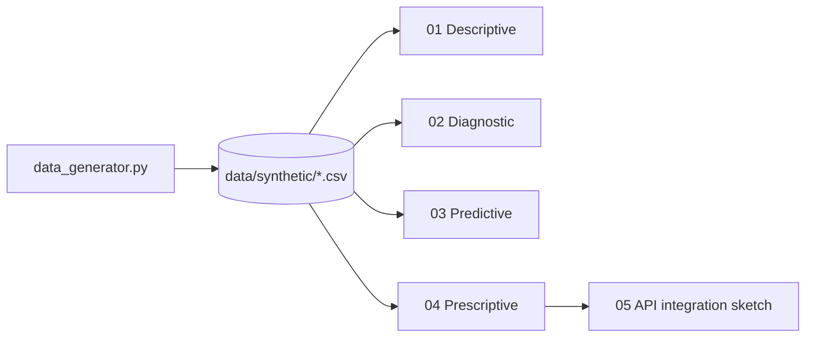

# cloud-infrastructure-support

> Pipeline analítico de extremo a extremo sobre telemetría sintética de
> infraestructura cloud — los cuatro pilares de la analítica (descriptivo,
> diagnóstico, predictivo, prescriptivo) aplicados a logs, tickets y métricas
> de salud de servidores.

[](https://www.python.org/downloads/)
[](LICENSE)

## ¿Por qué este proyecto?

Las áreas de "support" cloud (SRE / NOC / DevOps) acumulan toneladas de
telemetría heterogénea: logs estructurados, métricas de CPU/memoria, tickets de
incidentes. La pregunta interesante no es "¿qué pasó?" sino "¿qué va a pasar?
y ¿qué debemos hacer al respecto?". Este proyecto camina los cuatro niveles de
analítica sobre el mismo dataset sintético, mostrando cómo cada nivel agrega
valor incremental.

## Stack

| Capa | Tecnología |
|---|---|
| Generación sintética | `numpy` + `pandas` |
| Anomalías | `scikit-learn` (IsolationForest, LOF) |
| Forecasting | `prophet` / `statsmodels` (opcional) |
| Clasificación de riesgo | `scikit-learn` (gradient boosting, calibración) |
| Visualización | `matplotlib` + `seaborn` |

## Cuatro notebooks, cuatro niveles

| # | Notebook | Nivel | Pregunta |
|---|---|---|---|
| 01 | `01_descriptive_health_monitor.ipynb` | Descriptivo | ¿Qué está pasando ahora? |
| 02 | `02_diagnostic_anomaly_detection.ipynb` | Diagnóstico | ¿Por qué pasó este evento? |
| 03 | `03_predictive_ticket_forecasting.ipynb` | Predictivo | ¿Cuántos tickets voy a tener mañana? |
| 04 | `04_prescriptive_escalation_risk.ipynb` | Prescriptivo | ¿A qué ticket le doy prioridad? |
| 05 | `05_api_integration.ipynb` | Integración | Cómo expondría esto vía API |

## Arquitectura



## Quick Start

```bash
git clone https://github.com/MarioCasanovacf/Portfolio.git
cd Portfolio/cloud_infrastructure_support
pip install -e ".[dev,notebooks]"
python src/data_generator.py
jupyter lab notebooks/
pytest -m unit
```

## Estructura

```
cloud_infrastructure_support/
├── src/data_generator.py
├── notebooks/
│   ├── 01_descriptive_health_monitor.ipynb
│   ├── 02_diagnostic_anomaly_detection.ipynb
│   ├── 03_predictive_ticket_forecasting.ipynb
│   ├── 04_prescriptive_escalation_risk.ipynb
│   └── 05_api_integration.ipynb
├── data/synthetic/
└── tests/
```

## Licencia

MIT — ver [LICENSE](LICENSE).

## Contrato del portafolio

Sigue [PRODUCTION_TEMPLATE.md](../PRODUCTION_TEMPLATE.md).
