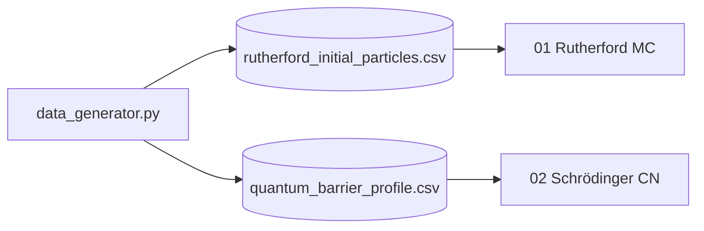

# computational-physics

> Dos experimentos numéricos clásicos: dispersión de Rutherford por Monte Carlo
> y la ecuación de Schrödinger evolucionada con el esquema implícito de
> **Crank–Nicolson**. La idea es aterrizar dos métodos numéricos pesados
> (estocástico vs determinístico) en problemas físicos que tienen interpretación
> intuitiva.

[](https://www.python.org/downloads/)
[](LICENSE)

## ¿Por qué este proyecto?

- **Rutherford**: introduce simulación Monte Carlo y muestreo por importancia.
- **Schrödinger / Crank–Nicolson**: introduce métodos espectrales y resolución
  de sistemas tridiagonales — el corazón de muchos solvers de PDEs.

Ambos casos están al alcance de un laptop, son visualizables, y muestran cómo
la física requiere herramientas numéricas distintas según el régimen.

## Stack

| Capa | Tecnología |
|---|---|
| Cómputo | `numpy` + `scipy.linalg` (tridiagonales) |
| Datos sintéticos | generador propio (`src/data_generator.py`) |
| Visualización | `matplotlib` (animaciones, contornos de probabilidad) |

## Notebooks

| # | Notebook | Método |
|---|---|---|
| 01 | `01_Rutherford_Scattering_Simulation.ipynb` | Monte Carlo de partículas α |
| 02 | `02_Schrodinger_Crank_Nicolson.ipynb` | Crank–Nicolson 1D |

## Arquitectura



## Quick Start

```bash
git clone https://github.com/MarioCasanovacf/Portfolio.git
cd Portfolio/computational_physics
pip install -e ".[dev,notebooks]"
python src/data_generator.py
jupyter lab notebooks/
pytest -m unit
```

## Licencia

MIT — ver [LICENSE](LICENSE).

## Contrato del portafolio

Sigue [PRODUCTION_TEMPLATE.md](../PRODUCTION_TEMPLATE.md).
