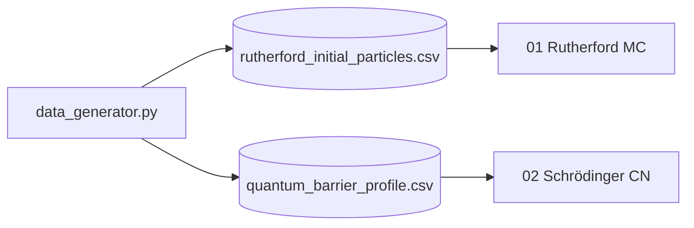

# computational-physics

> Two classic numerical experiments: Rutherford scattering by Monte Carlo and
> the Schrödinger equation evolved with the implicit **Crank–Nicolson** scheme.
> The point is to ground two heavy numerical methods (stochastic vs deterministic)
> in physical problems with intuitive interpretations.

[](https://www.python.org/downloads/)
[](LICENSE)

## Why this project

- **Rutherford**: introduces Monte Carlo simulation and importance sampling.
- **Schrödinger / Crank–Nicolson**: introduces spectral methods and tridiagonal
  system solvers — the core of many PDE solvers.

Both cases run on a laptop, are visualizable, and show how physics requires
different numerical tools depending on the regime.

## Stack

| Layer | Technology |
|---|---|
| Compute | `numpy` + `scipy.linalg` (tridiagonal solvers) |
| Synthetic data | in-house generator (`src/data_generator.py`) |
| Visualization | `matplotlib` (animations, probability contours) |

## Notebooks

| # | Notebook | Method |
|---|---|---|
| 01 | `01_Rutherford_Scattering_Simulation.ipynb` | Monte Carlo of α-particles |
| 02 | `02_Schrodinger_Crank_Nicolson.ipynb` | 1D Crank–Nicolson |

## Architecture



## Quick Start

```bash
git clone https://github.com/MarioCasanovacf/Portfolio.git
cd Portfolio/computational_physics
pip install -e ".[dev,notebooks]"
python src/data_generator.py
jupyter lab notebooks/
pytest -m unit
```

## License

MIT — see [LICENSE](LICENSE).
