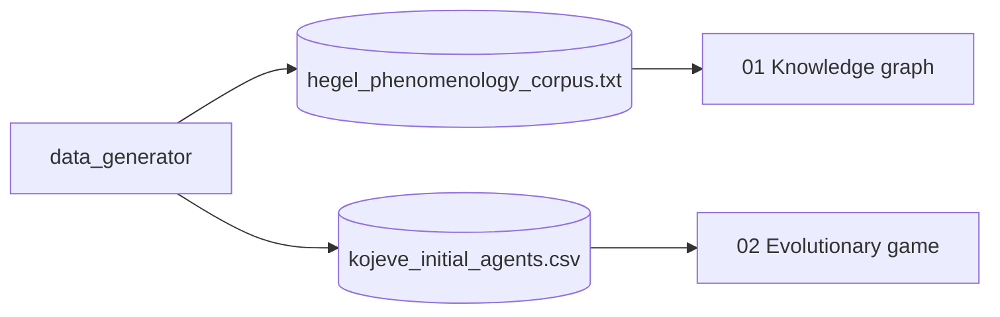

# continental-philosophy

> Filosofía continental aplicada con métodos cuantitativos:
> un **grafo dialéctico de conocimiento** sobre el corpus de la *Fenomenología
> del Espíritu* de Hegel y una simulación de **teoría de juegos evolutivos**
> sobre la dialéctica amo-esclavo de Kojève.

[](https://www.python.org/downloads/)
[](LICENSE)

## ¿Por qué este proyecto?

La filosofía continental rara vez se modela computacionalmente. Este proyecto
demuestra que dos de sus aparatos centrales —**dialéctica** (Hegel) y la
**lucha por reconocimiento** (Kojève)— pueden representarse como (a) un grafo
dirigido con centralidad eigenvector, y (b) un sistema evolutivo de agentes
con payoffs asimétricos. El resultado no pretende ser exégesis sino prueba de
que las herramientas cuantitativas pueden iluminar argumentos que normalmente
viven solo en prosa.

## Stack

| Capa | Tecnología |
|---|---|
| Corpus + grafo | `networkx` + tokenización ligera |
| Centralidad | `networkx.eigenvector_centrality` |
| Game theory | `numpy` (replicator dynamics) |
| Visualización | `matplotlib` |

## Notebooks

| # | Notebook | Método |
|---|---|---|
| 01 | `01_Dialectical_Knowledge_Graph.ipynb` | Grafo dialéctico + centralidad |
| 02 | `02_Kojeve_Evolutionary_Game_Theory.ipynb` | Replicator dynamics master/slave |

## Arquitectura



## Quick Start

```bash
git clone https://github.com/MarioCasanovacf/Portfolio.git
cd Portfolio/continental_philosophy
pip install -e ".[dev,notebooks]"
python src/data_generator.py
jupyter lab notebooks/
pytest -m unit
```

## Licencia

MIT — ver [LICENSE](LICENSE).

## Contrato del portafolio

Sigue [PRODUCTION_TEMPLATE.md](../PRODUCTION_TEMPLATE.md).
