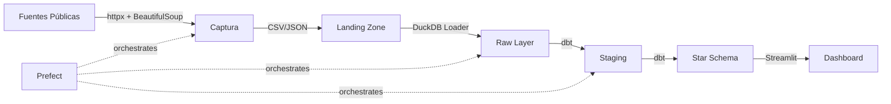

# 🏛️ Mexican Legislative Data Pipeline

Pipeline de datos end-to-end que captura, estructura y analiza datos legislativos mexicanos — datos que no existían en forma estructurada antes de este proyecto.

## ¿Por qué este proyecto?

Los datos legislativos mexicanos (votaciones nominales, asistencia, composición de comisiones) existen dispersos en sitios web gubernamentales sin APIs estructuradas. Este pipeline los captura, los modela en un esquema dimensional, y los expone para análisis.

**El diferenciador:** no es un proyecto que consume un CSV de Kaggle. Es infraestructura para datos que requirieron instrumentación de captura.

## Arquitectura



## Stack

| Capa | Tecnología |
|---|---|
| Captura | Python, httpx, BeautifulSoup |
| Warehouse | DuckDB (local) / Snowflake (producción) |
| Transformación | dbt con dbt-duckdb |
| Orquestación | Prefect 3.x |
| Dashboard | Streamlit + Plotly |
| CI/CD | GitHub Actions, Ruff, Mypy, Pytest |

## Estructura del Proyecto

```
legislative-data-pipeline/
├── src/
│   ├── capture/          # Scrapers y API clients
│   │   ├── base.py       # Base scraper con retries y logging
│   │   ├── dipmex.py     # Client para dipMex (datos académicos)
│   │   └── diputados.py  # Scraper para diputados.gob.mx
│   ├── loaders/          # Cargadores a DuckDB/Snowflake
│   ├── models/           # Pydantic models (data contracts)
│   └── config.py         # Configuración centralizada
├── sql/ddl/              # DDL para Snowflake (3 capas)
│   ├── 01_raw_schema.sql
│   ├── 02_staging_schema.sql
│   └── 03_dimensional_models.sql
├── flows/                # Prefect orchestration
│   └── legislative_pipeline.py
├── dbt_project/          # Transformaciones dbt
│   ├── models/staging/   # Limpieza y deduplicación
│   └── models/marts/     # Star schema dimensional
├── dashboard/            # Streamlit app
│   └── app.py
├── tests/                # Pytest suite
├── docs/                 # ADRs y arquitectura
│   ├── architecture.md
│   └── adr/
└── .github/workflows/    # CI pipeline
```

## Quick Start

```bash
# Clonar e instalar
git clone <repo-url>
cd legislative-data-pipeline
pip install -e ".[dev,dashboard]"

# Ejecutar captura (descarga datos de fuentes públicas)
python -m capture.cli dipmex

# Ejecutar pipeline completo con Prefect
python -m flows.legislative_pipeline

# Lanzar dashboard
streamlit run dashboard/app.py

# Correr tests
pytest tests/ -v
```

## Modelo Dimensional

**Star Schema** con SCD Type 2 en `dim_legislator` para rastrear cambios de bancada.

- **dim_legislator** — Perfiles con historicidad de partido
- **dim_party** — Referencia de partidos políticos
- **dim_date** — Calendario con metadata de periodos legislativos
- **fact_vote** — Votos individuales (grain: 1 legislador × 1 evento)
- **fact_vote_summary** — Resultados agregados por votación

## Decisiones de Diseño

Las decisiones técnicas están documentadas como ADRs en [`docs/adr/`](docs/adr/):

- [ADR 001: Prefect sobre Airflow](docs/adr/001-orchestrator-choice.md)
- [ADR 002: Star Schema sobre Snowflake Schema](docs/adr/002-star-schema-design.md)

## Fuentes de Datos

| Fuente | Tipo | Datos |
|---|---|---|
| [dipMex](https://github.com/emagar/dipMex) | CSV (GitHub) | Votaciones nominales, perfiles de legisladores |
| [diputados.gob.mx](https://www.diputados.gob.mx) | HTML (scraping) | Resúmenes de votación por legislatura |
| [INE Datos Abiertos](https://ine.mx/transparencia/datos-abiertos/) | CSV | Resultados electorales |

## CI/CD

GitHub Actions ejecuta en cada push/PR:
- **Ruff** — Linting y formateo
- **Mypy** — Type checking
- **Pytest** — Tests unitarios con coverage
- **dbt compile** — Validación de modelos SQL

---

*Proyecto de portafolio de Mario Casanova — Senior Business Analyst.*
*Demuestra: Python de producción, SQL avanzado (Snowflake), ETL/orquestación, modelado dimensional, BI.*
