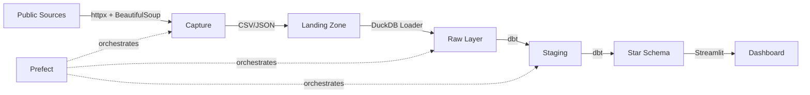

# 🏛️ Mexican Legislative Data Pipeline

End-to-end data pipeline that captures, structures, and analyzes Mexican
legislative data — data that did not exist in structured form before this
project.

## Why this project

Mexican legislative data (roll-call votes, attendance, committee composition)
lives scattered across government websites with no structured APIs. This
pipeline captures it, models it into a dimensional schema, and exposes it for
analysis.

**The differentiator:** this is not a project consuming a Kaggle CSV. It is
infrastructure for data that required custom capture instrumentation.

## Architecture



## Stack

| Layer | Technology |
|---|---|
| Capture | Python, httpx, BeautifulSoup |
| Warehouse | DuckDB (local) / Snowflake (production) |
| Transformation | dbt with dbt-duckdb |
| Orchestration | Prefect 3.x |
| Dashboard | Streamlit + Plotly |
| CI/CD | GitHub Actions, Ruff, Mypy, Pytest |

## Project structure

```
legislative-data-pipeline/
├── src/
│   ├── capture/          # Scrapers and API clients
│   │   ├── base.py       # Base scraper with retries and logging
│   │   ├── dipmex.py     # Client for dipMex (academic data)
│   │   └── diputados.py  # Scraper for diputados.gob.mx
│   ├── loaders/          # Loaders to DuckDB/Snowflake
│   ├── models/           # Pydantic models (data contracts)
│   └── config.py         # Centralized configuration
├── sql/ddl/              # DDL for Snowflake (3 layers)
│   ├── 01_raw_schema.sql
│   ├── 02_staging_schema.sql
│   └── 03_dimensional_models.sql
├── flows/                # Prefect orchestration
│   └── legislative_pipeline.py
├── dbt_project/          # dbt transformations
│   ├── models/staging/   # Cleaning and deduplication
│   └── models/marts/     # Dimensional star schema
├── dashboard/            # Streamlit app
│   └── app.py
├── tests/                # Pytest suite
├── docs/                 # ADRs and architecture
│   ├── architecture.md
│   └── adr/
└── .github/workflows/    # CI pipeline
```

## Quick Start

```bash
# Clone and install
git clone <repo-url>
cd legislative-data-pipeline
pip install -e ".[dev,dashboard]"

# Run capture (downloads data from public sources)
python -m capture.cli dipmex

# Run the full pipeline with Prefect
python -m flows.legislative_pipeline

# Launch dashboard
streamlit run dashboard/app.py

# Run tests
pytest tests/ -v
```

## Dimensional model

**Star schema** with SCD Type 2 on `dim_legislator` to track caucus changes.

- **dim_legislator** — Legislator profiles with party history
- **dim_party** — Reference data for political parties
- **dim_date** — Calendar with legislative-period metadata
- **fact_vote** — Individual votes (grain: 1 legislator × 1 event)
- **fact_vote_summary** — Aggregated results per vote

## Design decisions

Technical decisions are documented as ADRs in [`docs/adr/`](docs/adr/):

- [ADR 001: Prefect over Airflow](docs/adr/001-orchestrator-choice.md)
- [ADR 002: Star schema over Snowflake schema](docs/adr/002-star-schema-design.md)

## Data sources

| Source | Type | Data |
|---|---|---|
| [dipMex](https://github.com/emagar/dipMex) | CSV (GitHub) | Roll-call votes, legislator profiles |
| [diputados.gob.mx](https://www.diputados.gob.mx) | HTML (scraping) | Per-session voting summaries |
| [INE Open Data](https://ine.mx/transparencia/datos-abiertos/) | CSV | Election results |

## CI/CD

GitHub Actions runs on every push/PR:
- **Ruff** — Linting and formatting
- **Mypy** — Type checking
- **Pytest** — Unit tests with coverage
- **dbt compile** — SQL model validation

---

*Portfolio project by Mario Casanova — Senior Business Analyst.*
*Demonstrates: production Python, advanced SQL (Snowflake), ETL/orchestration, dimensional modeling, BI.*
