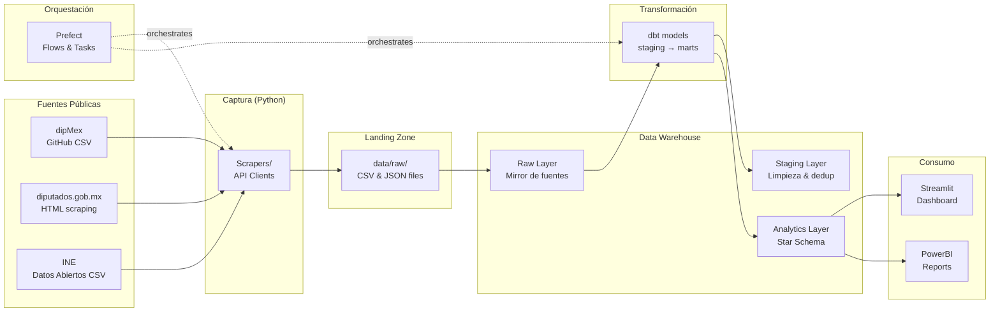

# Arquitectura del Pipeline de Datos Legislativos

## Diagrama General

## Capas del Pipeline

### 1. Captura (`src/capture/`)
- **DipMexClient:** Descarga datasets académicos de votaciones nominales desde GitHub.
- **DiputadosScraper:** Extrae registros de votación de sitl.diputados.gob.mx via HTML scraping.
- **BaseScraper:** Clase base con retry logic (exponential backoff), rate limiting, y logging estructurado.

### 2. Landing Zone (`data/raw/`)
- Archivos CSV/JSON tal como se capturaron.
- Cada archivo incluye metadata de linaje (_source_file, timestamp).
- Inmutables: nunca se modifican después de la captura.

### 3. Raw Layer (DuckDB: `raw` schema)
- Mirror fiel de los archivos capturados.
- Columnas de metadata: `_source_file`, `_loaded_at`.
- Sin transformaciones de negocio.

### 4. Staging Layer (dbt: `staging/`)
- Limpieza: casting de tipos, normalización de strings.
- Deduplicación: ROW_NUMBER() sobre business keys.
- Estandarización: valores de voto en español → enum inglés (FAVOR → FOR).
- Surrogate keys determinísticos (MD5 hash).

### 5. Analytics Layer (dbt: `marts/`)
- **Star Schema** con SCD Type 2 en dim_legislator.
- Dimensiones: `dim_legislator`, `dim_party`, `dim_date`, `dim_committee`.
- Facts: `fact_vote` (individual), `fact_vote_summary` (aggregate).
- Views analíticas: `v_party_cohesion`, `v_legislator_attendance`.

### 6. Consumo (`dashboard/`)
- Streamlit app con tres vistas: Overview, Party Analysis, Legislator Profiles.
- Conecta directamente a DuckDB (local) o Snowflake (producción).
- Visualizaciones con Plotly para interactividad.

## Stack Tecnológico

| Componente | Tecnología | Justificación |
|---|---|---|
| Lenguaje | Python 3.11+ | Stack principal; type hints, async support |
| HTTP Client | httpx | Async-ready, connection pooling |
| Scraping | BeautifulSoup + lxml | Robusto para HTML legislativo |
| Warehouse (local) | DuckDB | Columnar, SQL compatible, zero-config |
| Warehouse (prod) | Snowflake | Enterprise DWH con streams, tasks, time travel |
| Transformación | dbt (dbt-duckdb) | SQL-based transforms, testing, documentation |
| Orquestación | Prefect 3.x | Pythonic, zero-infra local, retries nativos |
| Validación | Pydantic 2.x | Data contracts entre capas |
| Dashboard | Streamlit + Plotly | Rápido de construir, interactivo, exportable |
| CI/CD | GitHub Actions | Lint, type check, tests, dbt compile |
| Linting | Ruff | Fast, replaces flake8+isort+black |
| Type Check | Mypy | Static type verification |
| Testing | Pytest | Standard, fixtures, parametrize, coverage |
