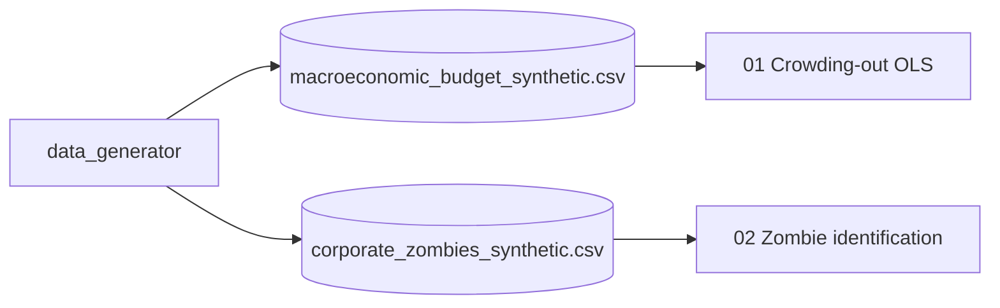

# macroeconomic-capture

> Dos hipótesis macroeconómicas que normalmente solo se discuten en prosa,
> aquí cuantificadas con datos sintéticos y modelos econométricos básicos:
> el **crowding-out fiscal** sobre la inversión privada, y la identificación
> de **empresas zombies** (firmas que sobreviven solo por costos de capital
> artificialmente bajos).

[](https://www.python.org/downloads/)
[](LICENSE)

## ¿Por qué este proyecto?

La macroeconomía está plagada de hipótesis difíciles de testear porque los
experimentos controlados son imposibles. Pero podemos: (a) generar datos
sintéticos consistentes con un mecanismo causal hipotético, (b) ajustar el
modelo que asume el mecanismo, y (c) ver qué condiciones hacen detectable el
efecto. Esto es valioso pedagógicamente y como banco de pruebas para
metodología.

## Stack

| Capa | Tecnología |
|---|---|
| Generación sintética | `numpy` + `pandas` |
| Modelos | `statsmodels` (OLS, paneles, IV) |
| Visualización | `matplotlib` + `seaborn` |

## Notebooks

| # | Notebook | Hipótesis |
|---|---|---|
| 01 | `01_Fiscal_Crowding_Out.ipynb` | Más deuda pública → menos inversión privada |
| 02 | `02_Zombie_Corporations.ipynb` | Tasas bajas mantienen vivas firmas no rentables |

## Arquitectura



## Quick Start

```bash
git clone https://github.com/MarioCasanovacf/Portfolio.git
cd Portfolio/macroeconomic_capture
pip install -e ".[dev,notebooks]"
python src/data_generator.py
jupyter lab notebooks/
pytest -m unit
```

## Licencia

MIT — ver [LICENSE](LICENSE).

## Contrato del portafolio

Sigue [PRODUCTION_TEMPLATE.md](../PRODUCTION_TEMPLATE.md).
