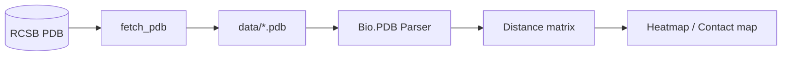

# proteins-alphafold-distances

> Spatial distance analytics on protein structures from the RCSB Protein Data
> Bank — using ubiquitin (1UBQ) as a teaching case for in-silico geometric
> analysis at portfolio scale.

[](https://www.python.org/downloads/)
[](LICENSE)

## ¿Por qué este proyecto?

Las distancias inter-átomicas son la materia prima del plegamiento de proteínas
y de modelos como AlphaFold. Este proyecto descarga estructuras reales del PDB
y reproduce análisis de distancias / contactos sin requerir GPUs ni bases de
datos especializadas — útil para entender qué computan los modelos de plegamiento
sin la opacidad de un modelo entrenado.

## Stack

| Capa | Tecnología | Por qué |
|---|---|---|
| Fetch | `urllib` + RCSB PDB | API pública, sin autenticación |
| Parsing | `biopython` | Estándar para PDB/mmCIF |
| Análisis | `numpy` + `pandas` | Distancias y contact maps |
| Visualización | `matplotlib` + `seaborn` | Heatmaps, Ramachandran-style plots |

## Arquitectura



## Quick Start

```bash
git clone https://github.com/MarioCasanovacf/Portfolio.git
cd Portfolio/proteins_alphafold_distances
pip install -e ".[dev,notebooks]"
python src/data_fetcher.py            # baja 1UBQ
jupyter lab notebooks/                # abre el análisis
pytest -m unit                        # smoke tests
```

## Estructura

```
proteins_alphafold_distances/
├── src/
│   └── data_fetcher.py       # PDB downloader (1UBQ por defecto)
├── notebooks/
│   └── 01_AlphaFold_Spatial_Distances.ipynb
├── data/
│   └── *.pdb                 # estructuras descargadas
├── tests/
│   └── unit/test_data_fetcher.py
└── pyproject.toml
```

## Datos

| Archivo | Origen | Descripción |
|---|---|---|
| `1ubq.pdb` | RCSB PDB | Ubiquitina humana, 76 residuos — caso canónico |

## Licencia

MIT — ver [LICENSE](LICENSE). Código del portafolio público de
[Mario Casanova](https://github.com/MarioCasanovacf).

## Contrato del portafolio

Este proyecto sigue el contrato uniforme de
[`PRODUCTION_TEMPLATE.md`](../PRODUCTION_TEMPLATE.md).
