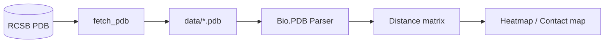

# proteins-alphafold-distances

> Spatial distance analytics on protein structures from the RCSB Protein Data
> Bank — using ubiquitin (1UBQ) as a teaching case for in-silico geometric
> analysis at portfolio scale.

[](https://www.python.org/downloads/)
[](LICENSE)

## Why this project

Inter-atomic distances are the raw material of protein folding and of models
like AlphaFold. This project downloads real PDB structures and reproduces
distance/contact analysis without GPUs or specialized databases — useful for
understanding what folding models compute, without the opacity of a trained
network.

## Stack

| Layer | Technology | Why |
|---|---|---|
| Fetch | `urllib` + RCSB PDB | Public API, no authentication |
| Parsing | `biopython` | Standard for PDB/mmCIF |
| Analysis | `numpy` + `pandas` | Distance matrices and contact maps |
| Visualization | `matplotlib` + `seaborn` | Heatmaps, Ramachandran-style plots |

## Architecture



## Quick Start

```bash
git clone https://github.com/MarioCasanovacf/Portfolio.git
cd Portfolio/proteins_alphafold_distances
pip install -e ".[dev,notebooks]"
python src/data_fetcher.py            # downloads 1UBQ
jupyter lab notebooks/                # opens the analysis
pytest -m unit                        # smoke tests
```

## Layout

```
proteins_alphafold_distances/
├── src/
│   └── data_fetcher.py       # PDB downloader (1UBQ by default)
├── notebooks/
│   └── 01_AlphaFold_Spatial_Distances.ipynb
├── data/
│   └── *.pdb                 # downloaded structures
├── tests/
│   └── unit/test_data_fetcher.py
└── pyproject.toml
```

## Data

| File | Source | Description |
|---|---|---|
| `1ubq.pdb` | RCSB PDB | Human ubiquitin, 76 residues — canonical case |

## License

MIT — see [LICENSE](LICENSE). Public portfolio code by
[Mario Casanova](https://github.com/MarioCasanovacf).
