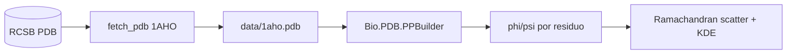

# proteins-ramachandran-plot

> Generación de gráficos de Ramachandran (ángulos diedros φ/ψ) desde
> estructuras PDB reales — caso de estudio: **1AHO** (neurotoxina pequeña con
> hélices α y láminas β bien definidas).

[](https://www.python.org/downloads/)
[](LICENSE)

## ¿Por qué este proyecto?

El gráfico de Ramachandran es la herramienta canónica para validar el
plegamiento de proteínas — cada punto corresponde a un par (φ, ψ) por residuo y
las regiones permitidas reflejan restricciones estéricas universales.
Reproducirlo desde cero (sin PyMOL ni Chimera) demuestra dominio práctico de
geometría molecular y de la API estructural de Biopython.

## Stack

| Capa | Tecnología |
|---|---|
| Fetch | `urllib` + RCSB PDB |
| Parsing | `biopython` (Bio.PDB) |
| Cálculo de diedros | `Bio.PDB.PPBuilder` + trigonometría manual |
| Visualización | `matplotlib` + `seaborn` (kde overlay) |

## Arquitectura



## Quick Start

```bash
git clone https://github.com/MarioCasanovacf/Portfolio.git
cd Portfolio/proteins_ramachandran_plot
pip install -e ".[dev,notebooks]"
python src/data_fetcher.py
jupyter lab notebooks/
pytest -m unit
```

## Estructura

```
proteins_ramachandran_plot/
├── src/data_fetcher.py
├── notebooks/01_Ramachandran_Plot_Generator.ipynb
├── data/1aho.pdb
├── tests/unit/test_data_fetcher.py
└── pyproject.toml
```

## Licencia

MIT — ver [LICENSE](LICENSE).

## Contrato del portafolio

Sigue [PRODUCTION_TEMPLATE.md](../PRODUCTION_TEMPLATE.md).
