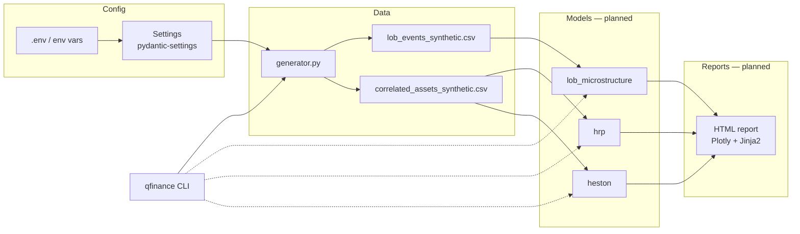

# quantitative-finance

> Production-grade toolkit for three foundational quantitative-finance workloads:
> Limit Order Book microstructure, exotic-option pricing under stochastic
> volatility, and Hierarchical Risk Parity portfolio allocation.

[](https://github.com/MarioCasanovacf/Portfolio/actions)
[](https://www.python.org/downloads/)
[](LICENSE)
[](https://github.com/astral-sh/ruff)

## ¿Por qué este proyecto?

Las tres rutinas presentadas — reconstrucción de LOB, valuación de opciones
asiáticas con Heston, y asignación de capital con HRP — son ejercicios canónicos
de finanzas cuantitativas que normalmente viven en notebooks dispersos sin
infraestructura. Este repo los promueve a un toolkit instalable, reproducible
bit-a-bit y testeado, alineado con el contrato del portafolio
([`PRODUCTION_TEMPLATE.md`](../PRODUCTION_TEMPLATE.md)).

El objetivo no es presentar resultados nuevos sino **demostrar madurez de
ingeniería** en un dominio que muchos portfolios solo prototipean.

## Stack

| Capa | Tecnología | Por qué |
|---|---|---|
| Configuración | `pydantic-settings` v2 | Type-safe, env-aware, jerárquica |
| Logging | `structlog` v24 | Salida estructurada, contextual |
| Datos | `numpy` + `pandas` | Estándar del ecosistema cuantitativo |
| Modelos | `scipy`, `scikit-learn` | Clustering jerárquico para HRP, optimización |
| Tests | `pytest` + `pytest-cov` | Markers `unit`/`integration`, threshold 75% |
| Calidad | `ruff` + `mypy` (strict) + `bandit` + `gitleaks` | Pre-commit + CI |
| CI | GitHub Actions | Matrix Python 3.11/3.12/3.13 |

## Arquitectura



## Quick Start

```bash
git clone https://github.com/MarioCasanovacf/Portfolio.git
cd Portfolio/quantitative_finance
pip install -e ".[dev,notebooks]"
qfinance generate-data --all     # regenera ambos CSV deterministas
pytest -m unit                   # tests rápidos
jupyter lab notebooks/           # abre los análisis
```

## Estructura

```
quantitative_finance/
├── src/quantitative_finance/
│   ├── config.py            # Pydantic Settings, env_prefix QFINANCE_
│   ├── cli.py               # entrypoint qfinance
│   ├── data/
│   │   └── generator.py     # LOB + asset prices, deterministic
│   ├── utils/
│   │   └── logging.py       # structlog setup
│   └── models/              # [planned] HRP, Heston, LOB analytics
├── tests/
│   ├── conftest.py          # fixtures compartidas
│   └── unit/                # tests con @pytest.mark.unit | integration
├── notebooks/               # análisis exploratorios
├── data/                    # CSVs generados
├── docs/
│   ├── architecture.md
│   └── adr/                 # Architecture Decision Records
├── .github/workflows/ci.yml
├── .pre-commit-config.yaml
└── pyproject.toml
```

## Configuración

Todas las opciones se sobrescriben vía variables de entorno con prefijo
`QFINANCE_` o vía un archivo `.env`:

```bash
QFINANCE_RANDOM_SEED=99 qfinance generate-data --lob
QFINANCE_LOB_N_EVENTS=100000 qfinance generate-data --lob
QFINANCE_LOG_LEVEL=DEBUG qfinance generate-data --all
```

Ver [`config.py`](src/quantitative_finance/config.py) para la lista completa.

## ADRs

Decisiones arquitectónicas registradas en [`docs/adr/`](docs/adr/):

- [001 — Synthetic data strategy](docs/adr/001-synthetic-data-strategy.md)
- [002 — Modular package layout vs flat](docs/adr/002-modular-vs-flat-layout.md)

## Contribuir

Ver [CONTRIBUTING.md](CONTRIBUTING.md). El proyecto se adhiere al
[contrato de producción del portafolio](../PRODUCTION_TEMPLATE.md).

## Roadmap

Ver [CHANGELOG.md](CHANGELOG.md) y [PLAN.md](PLAN.md) para el plan de elevación
incremental (promoción de notebooks a módulos, reportes HTML, validación
walk-forward).

## Licencia

MIT — ver [LICENSE](LICENSE).
