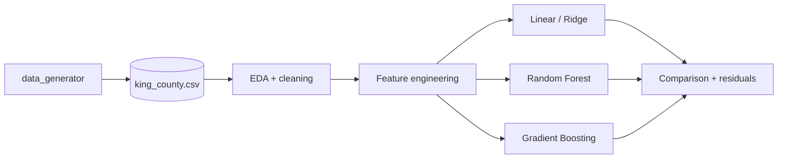

# real-estate

> House sale price prediction on the **King County (Seattle area, 2014–2015)**
> dataset — EDA, feature engineering, and regression models, done with the
> discipline of a production project rather than as a throwaway notebook.

[](https://www.python.org/downloads/)
[](LICENSE)

## Why this project

The King County dataset is the "Iris of real estate" — everyone uses it
because it is accessible, messy enough to be interesting, and has a clear
target variable (`price`). Most notebooks that touch it stop at superficial
EDA. This project walks the full pipeline: cleaning → geospatial feature
engineering → linear vs gradient-boosted baselines → residual diagnostics.

## Stack

| Layer | Technology |
|---|---|
| EDA + transformations | `pandas` + `numpy` |
| Visualization | `matplotlib` + `seaborn` |
| Models | `scikit-learn` (linear, ridge, RF, GBM) |
| Optional boosting | `xgboost` / `lightgbm` |

## Analysis

| Notebook | Question |
|---|---|
| `house_sales_king_county.ipynb` | Which features best explain price, and which baseline wins? |

## Architecture



## Quick Start

```bash
git clone https://github.com/MarioCasanovacf/Portfolio.git
cd Portfolio/real_estate
pip install -e ".[dev,notebooks]"
python src/data_generator.py
jupyter lab house_sales_king_county.ipynb
pytest -m unit
```

## License

MIT — see [LICENSE](LICENSE).
