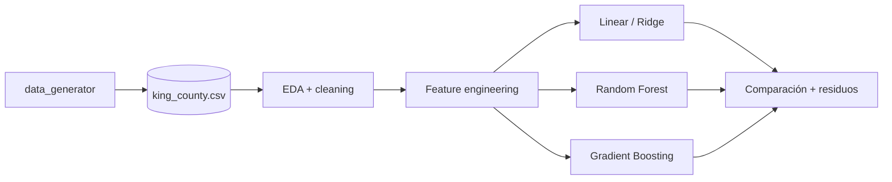

# real-estate

> Predicción de precios de venta de casas sobre el dataset de **King County
> (Seattle area, 2014-2015)** — EDA, ingeniería de características, y modelos
> de regresión, hechos con la disciplina de un proyecto productivo, no como
> notebook desechable.

[](https://www.python.org/downloads/)
[](LICENSE)

## ¿Por qué este proyecto?

El King County dataset es el "Iris de real estate" — todo el mundo lo usa
porque es accesible, suficientemente desordenado para ser interesante, y tiene
una variable objetivo clara (`price`). Pero la mayoría de los notebooks que lo
abordan se quedan en EDA superficial. Este proyecto recorre el pipeline
completo: limpieza → feature engineering geoespacial → comparación de
baselines lineales vs gradient boosting → diagnóstico de residuos.

## Stack

| Capa | Tecnología |
|---|---|
| EDA + transformaciones | `pandas` + `numpy` |
| Visualización | `matplotlib` + `seaborn` |
| Modelos | `scikit-learn` (linear, ridge, RF, GBM) |
| Boosting opcional | `xgboost` / `lightgbm` |

## Análisis

| Notebook | Pregunta |
|---|---|
| `house_sales_king_county.ipynb` | ¿Qué features explican mejor el precio y qué baseline gana? |

## Arquitectura



## Quick Start

```bash
git clone https://github.com/MarioCasanovacf/Portfolio.git
cd Portfolio/real_estate
pip install -e ".[dev,notebooks]"
python src/data_generator.py
jupyter lab house_sales_king_county.ipynb
pytest -m unit
```

## Licencia

MIT — ver [LICENSE](LICENSE).

## Contrato del portafolio

Sigue [PRODUCTION_TEMPLATE.md](../PRODUCTION_TEMPLATE.md).
