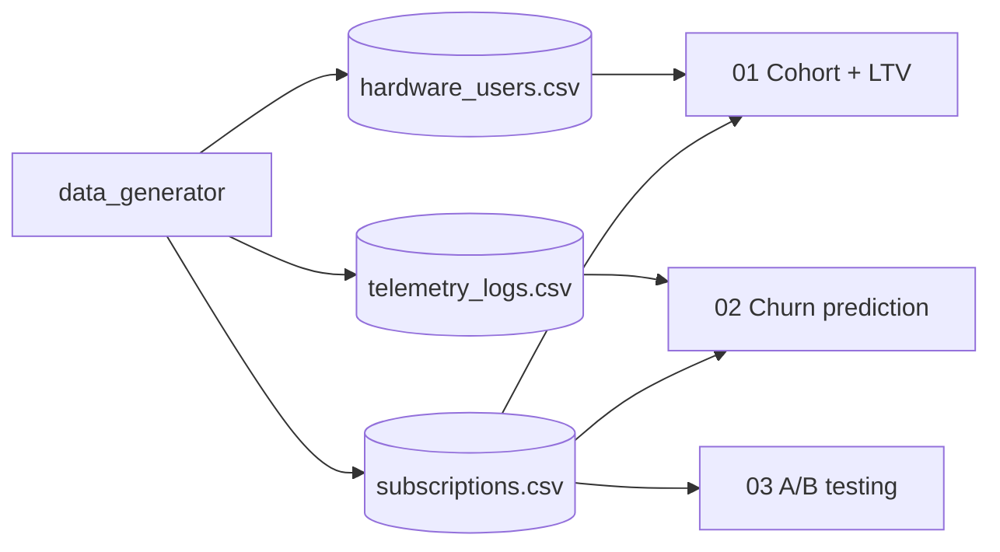

# subscription-economics

> Tres preguntas canónicas de un negocio de suscripción —
> ¿quién se queda?, ¿quién se va?, ¿qué intervención funciona? —
> resueltas con cohortes, predicción de churn desde telemetría, y A/B testing de
> onboarding sobre datos sintéticos pero estructuralmente realistas.

[](https://www.python.org/downloads/)
[](LICENSE)

## ¿Por qué este proyecto?

La economía de suscripción se gana o se pierde en tres frentes interrelacionados:
**retención** (cohorte), **predicción de abandono** (early warning), y
**experimentación causal** (A/B). Este proyecto los aborda como un sistema
coherente: las cohortes alimentan al modelo de churn, y los resultados del
experimento informan la intervención en cohortes futuras.

## Stack

| Capa | Tecnología |
|---|---|
| Datos sintéticos | `numpy` + `pandas` |
| Análisis de cohortes | `pandas` (resample, groupby) |
| Survival / LTV | `lifelines` |
| Churn prediction | `scikit-learn` (gradient boosting + calibración) |
| A/B testing | `scipy.stats` + bootstrap |
| Visualización | `matplotlib` + `seaborn` |

## Notebooks

| # | Notebook | Pregunta |
|---|---|---|
| 01 | `01_Cohort_Retention_and_LTV.ipynb` | ¿Cuál es el LTV por cohorte? |
| 02 | `02_Churn_Prediction_Telemetry.ipynb` | ¿Quién va a cancelar próximamente? |
| 03 | `03_AB_Testing_Onboarding.ipynb` | ¿El nuevo onboarding mueve la aguja? |

## Arquitectura



## Quick Start

```bash
git clone https://github.com/MarioCasanovacf/Portfolio.git
cd Portfolio/subscription_economics
pip install -e ".[dev,notebooks]"
python src/data_generator.py
jupyter lab notebooks/
pytest -m unit
```

## Datos sintéticos

| CSV | Filas | Descripción |
|---|---|---|
| `hardware_users.csv` | usuarios | Características del usuario y dispositivo |
| `subscriptions.csv` | suscripciones | Plan, fechas de inicio/fin, estado |
| `telemetry_logs_202303.csv` | eventos | Telemetría mensual para predicción de churn |

## Licencia

MIT — ver [LICENSE](LICENSE).

## Contrato del portafolio

Sigue [PRODUCTION_TEMPLATE.md](../PRODUCTION_TEMPLATE.md).
