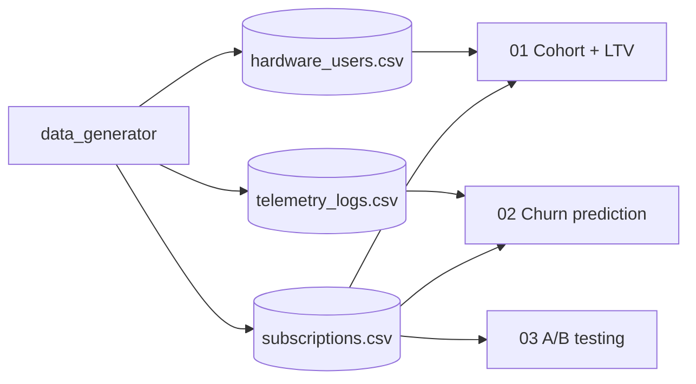

# subscription-economics

> Three canonical questions for a subscription business —
> who stays, who leaves, which intervention works —
> answered with cohort retention, churn prediction from telemetry, and
> onboarding A/B testing on synthetic but structurally realistic data.

[](https://www.python.org/downloads/)
[](LICENSE)

## Why this project

A subscription business is won or lost across three interrelated fronts:
**retention** (cohort), **churn prediction** (early warning), and
**causal experimentation** (A/B). This project addresses them as a coherent
system: cohorts feed the churn model, and experiment results inform the
intervention applied to future cohorts.

## Stack

| Layer | Technology |
|---|---|
| Synthetic data | `numpy` + `pandas` |
| Cohort analysis | `pandas` (resample, groupby) |
| Survival / LTV | `lifelines` |
| Churn prediction | `scikit-learn` (gradient boosting + calibration) |
| A/B testing | `scipy.stats` + bootstrap |
| Visualization | `matplotlib` + `seaborn` |

## Notebooks

| # | Notebook | Question |
|---|---|---|
| 01 | `01_Cohort_Retention_and_LTV.ipynb` | What is the LTV per cohort? |
| 02 | `02_Churn_Prediction_Telemetry.ipynb` | Who is about to cancel? |
| 03 | `03_AB_Testing_Onboarding.ipynb` | Does the new onboarding move the needle? |

## Architecture



## Quick Start

```bash
git clone https://github.com/MarioCasanovacf/Portfolio.git
cd Portfolio/subscription_economics
pip install -e ".[dev,notebooks]"
python src/data_generator.py
jupyter lab notebooks/
pytest -m unit
```

## Synthetic data

| CSV | Rows | Description |
|---|---|---|
| `hardware_users.csv` | users | User and device characteristics |
| `subscriptions.csv` | subscriptions | Plan, start/end dates, status |
| `telemetry_logs_202303.csv` | events | Monthly telemetry for churn prediction |

## License

MIT — see [LICENSE](LICENSE).
